There are many places you can find higher education data. Below are a
few publicly-available sources with instructions on how to find and
download data sets to use in your research. This list is by no means
complete, but should give you a general idea of what's available.

# NCES Surveys

The [National Center for Education Statistics
(NCES)](https://nces.ed.gov) is part of the Department of Education's
Institute of Education Sciences (IES). NCES offers a large number of
resources for researchers interested in higher education. 

Among these are longitudinal surveys that follow different cohorts of
students from high school through college and beyond.

Specifically, we'll go through the steps to download the [Education
Longitudinal Study of 2002
(ELS)](https://nces.ed.gov/surveys/els2002/). The good news is that
the process is the same for the other surveys.

To get to the online code book you'll use to download the raw data
files, head to the NCES homepage
([nces.ed.gov](https://nces.ed.gov)) and click in the
following order:
1. _Menu_
1. _Data & Tools_
1. _Downloads Microdata/Raw Data_
1. _EDAT_

You may see a couple of popups --- just agree. Once you've clicked
through those, you should see the code book home screen. From here, you
can access a number of data sets. We'll focus on ELS, but as I said
above, the process is the same: just choose another data set from the
code book homepage if you'd rather use that data.

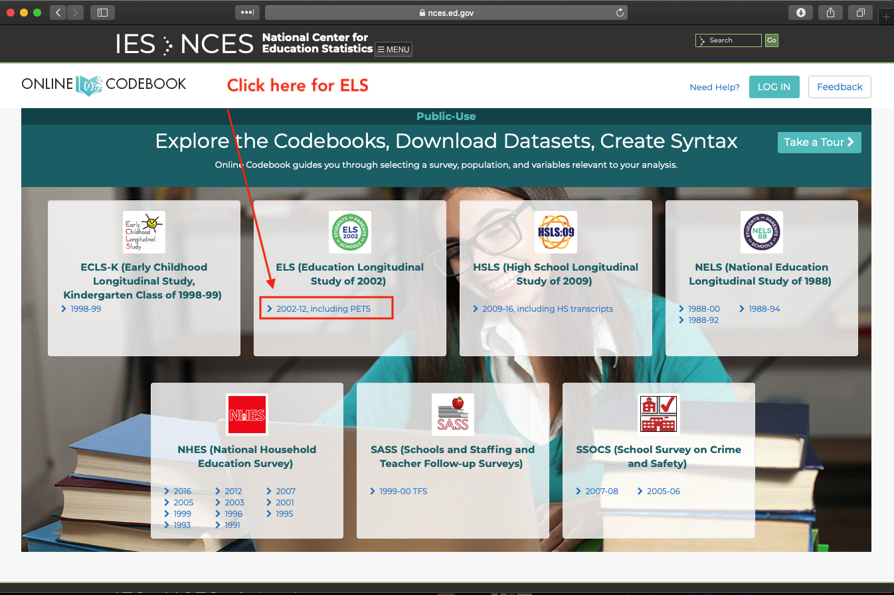

When you choose ELS, you'll see the online code book. You can (and
should) use this to learn about variables --- their definitions, how
they're constructed, missing values, _etc_. You can also use this tool
to only select a few variables for download. Don't do that! You should
plan to download the full data set and do any filtering or subsetting
in your analytic code.

Click the _Downloads_ button to get the data.

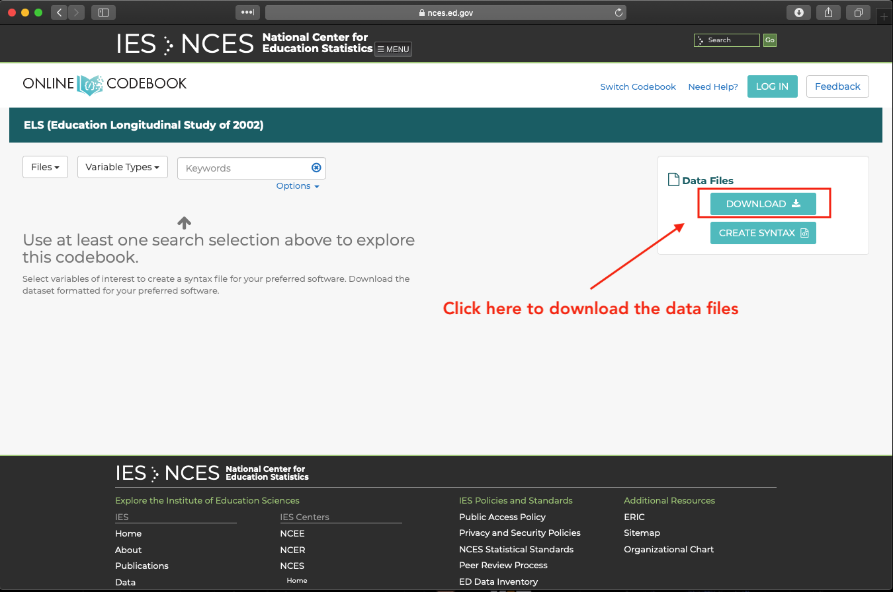

You'll be presented with a number of file types. Because you are using
R, you could read in all these data types --- either with standard
functions or functions from the tidyverse
[**haven**](https://haven.tidyverse.org) package. 

My recommendation:

- **If you don't care about labels**: Download the CSV version for
  maximum portability
- **If you'd like labeled data**: Download the STATA version and use
  `haven::read_dta()` to input the data
  
I generally like labels, so we'll choose the STATA version

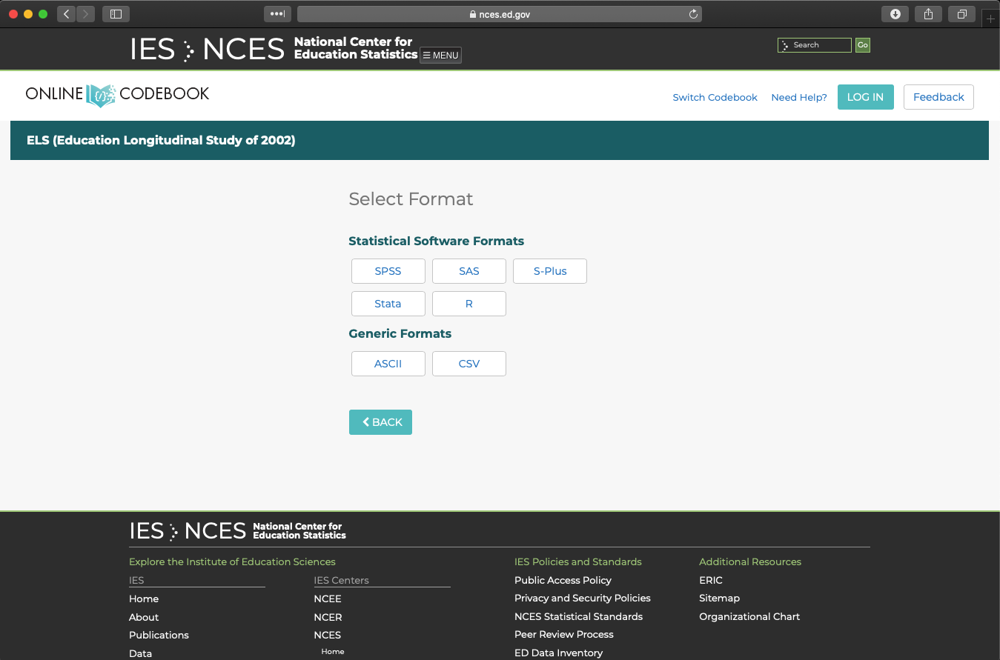

After choosing your file version, you can finally download the
files. Go ahead and click each box to download all the files.

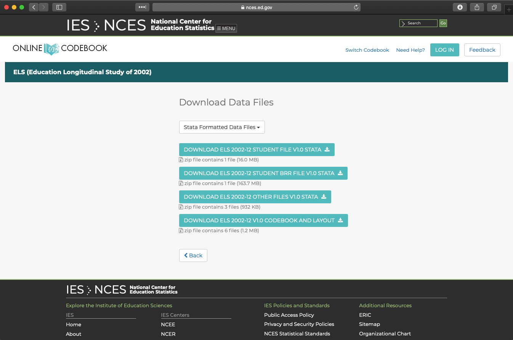

# NLS

The Bureau of Labor Statistics (aside from a lot of other useful
information) has a number of [National Longitudinal
Surveys](https://www.bls.gov/nls/). These are similar to those from
the NCES, but much more expansive. They include:

- National Longitudinal Survey of Youth 1997 (NLSY97)
- National Longitudinal Survey of Youth 1979 (NLSY79)
- NLSY79 Children and Young Adults (NLSCYA) 
- National Longitudinal Surveys of Young Women and Mature Women (NLSW)
- National Longitudinal Surveys of Young Men and Older Men (NLSM)

If you decide to use one of these surveys in your work, it will
probably be the NLSY97, which began following a cohort of high schools
students in 1997. 

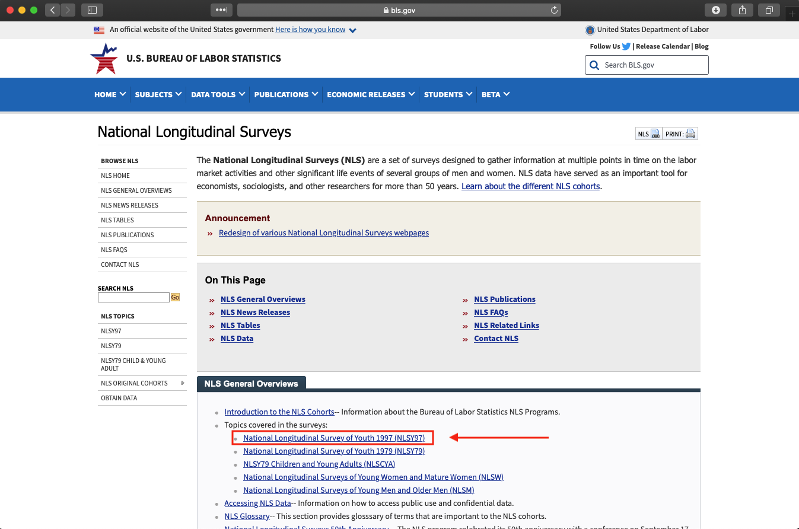

## Investigator

Scrolling down on the NLS97 page, you'll see a section for
**Accessing** the data via the _Investigator_. Because the NLSY is so
large, you may choose to go this route.

You'll be shown a new external link. Click it to go to the data
investigator.

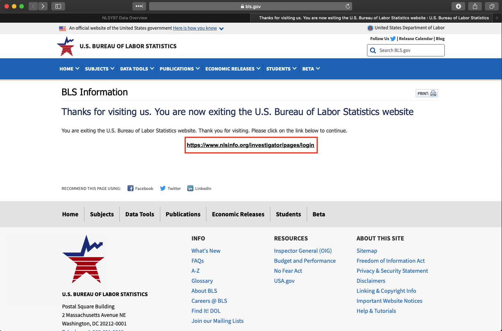

You can create a log in, which is nice if you come back often since
you can save tag sets (variable groups you want to download), or just
log in as a guest.

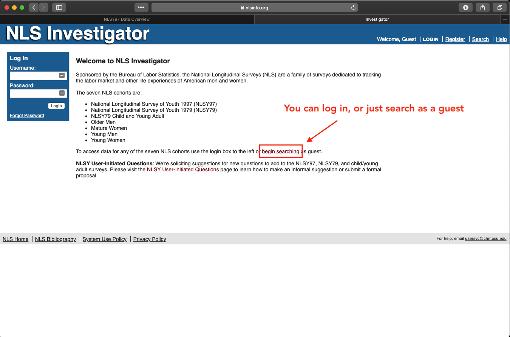

Once inside, the investigator will allow you to choose which NLS data
you want to access. So even though we got here via the NLSY97 page, we
can still look at NLSY79 data if we want. Whichever you choose, go
ahead a choose to look at all data rounds.

Now you can explore the data via the menu tree on the left side of the
page. When you find a variable or set of variables you want to
download, be sure to click the box next to the variable name. When you
are finished, click the _Save/Download_ tab.

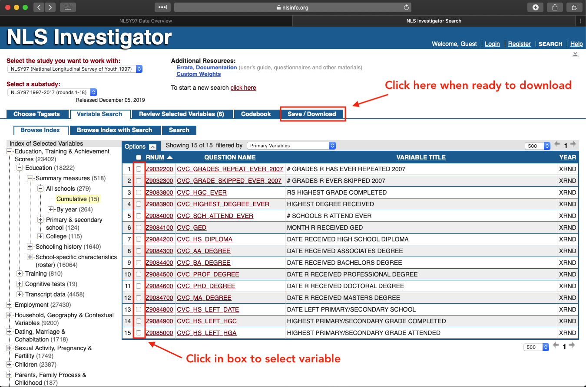

On the next screen, you'll be able to save your tag set (meaning, not
download the data, but name and keep the variable list you've chosen
for a later date) or download. 

Choose the _Advanced Download_ tab. Within that tab, choose which file
type you want to download (I've chosen just plain CSV here) and what
you want to call the download. When you're ready, click the _download_
button.

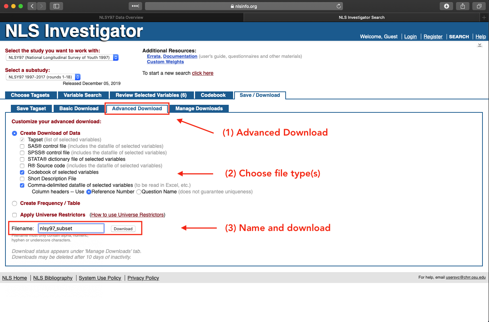

After your data set is prepared, you can download it to your
computer.

## Direct download of full NLS data sets

Alternately, you can directly download the full NLS data files at
[www.nlsinfo.org/accessing-data-cohorts](https://www.nlsinfo.org/accessing-data-cohorts). I
would recommend this approach if you think you're going to want a
large number of variables. Also, you'll eventually find it easier to
do your variable selection in R rather than via the Investigator.

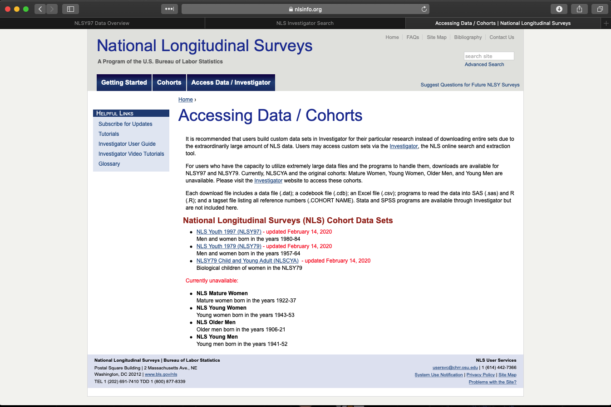

# IPEDS

For institution-level information, the [Integrated Postsecondary
Education Data System (IPEDS)](https://nces.ed.gov/ipeds/) will likely
be your first stop. While the IPEDS site
([nces.ed.gov/ipeds](https://nces.ed.gov/ipeds/)) will let you explore
individual institutions or use a portal to select particular variables
(like the BLS investigator), you'll want to just download the raw
files. Begin by selecting _Use the Data_.

On the next page, look in the right column for the section _Survey
Data_. From the drop down menu, choose _Complete data files_.

**NB:** If you know how to work with databases, the _Access databases_
may be useful for you. But to use these, you either need a Microsoft
Access license or a program to convert them to another format (like
SQLite).

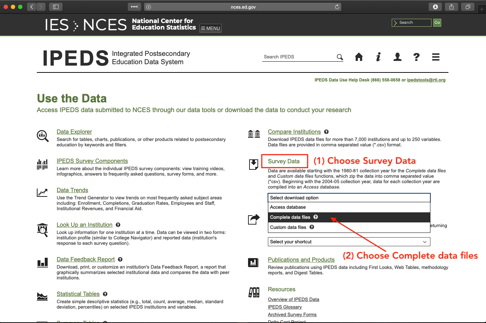

You may see a popup window --- if so, just agree. You'll now see a
pretty lonely page. If you have a specific file or year you know you
want, use the two drop down menus to filter your search. Otherwise,
just click the _Continue_ button to see your options.

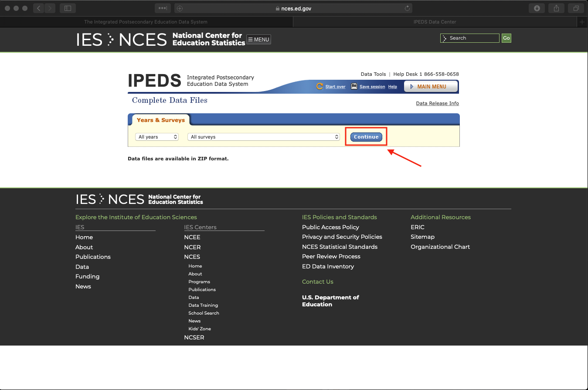

Click the links in the _Data File_ column to get zipped versions of
the CSV files. If you want a Stata data file instead, choose the link
from the _Stata Data File_ column. You will probably want to grab the
_Dictionary_ file while you're at it.

_How do I know which file I need?_, you might be asking. If you are
unsure, you may want to download the dictionary file first and check
for the data element(s) you think you need. After a while, you'll get
better at knowing (or reasonably guessing) which file is the one you
need based on the names.

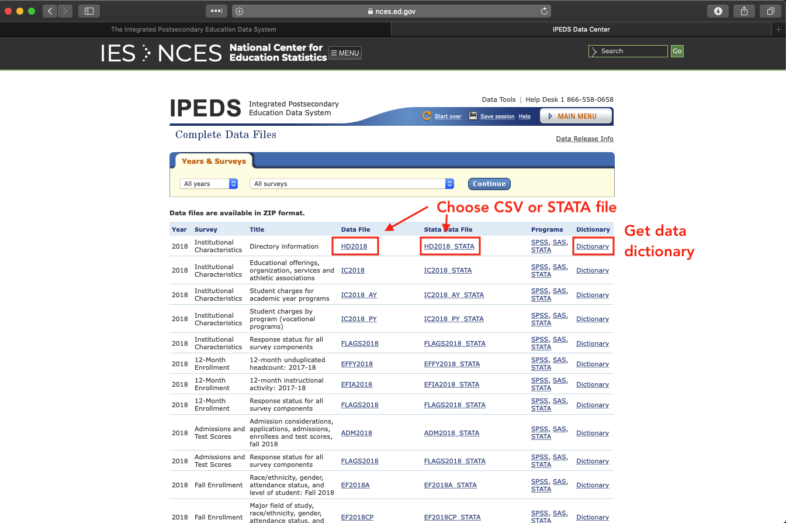

## Download all of IPEDS via R

If you don't want to bother with the portal, I've written an R script
that will download the entirety of IPEDS to your computer (a little
over 1 GB if you only want one type of data file). See
[github.com/btskinner/downloadipeds](https://github.com/btskinner/downloadipeds)
for the script and information on how to use it.

# College Scorecard

Though it's intended to give students and their families better
information about their college options, the [College
Scorecard](https://collegescorecard.ed.gov) offers data that's useful
for research. In particular, you can find earnings data linked to
schools and programs that you can't find anywhere else.

## Direct

If you go to the College Scorecard homepage
([collegescorecard.ed.gov](https://collegescorecard.ed.gov)), you'll
see the portal that students use. Scroll to the bottom of the page.

At the bottom of the page, you'll see a link to download the data
files that power the Scorecard. 

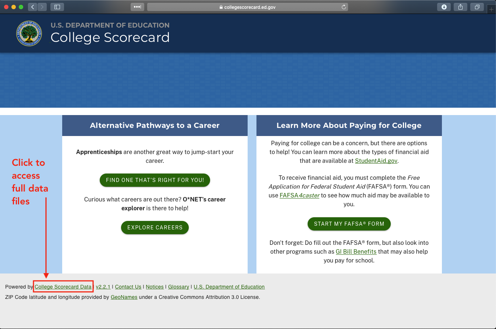

On the data page, you can download the full set of files or just the
latest data. Unless you have a good reason to do otherwise, I would
recommend getting all the data. You may also want to follow the
_Documentation_ tab to get the data documentation.

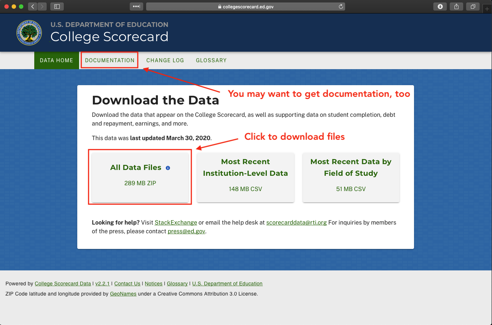

## `rscorecard`

You can also download College Scorecard data directly from R using the
**rscorecard** package, which accesses Scorecard data via an API. See
[btskinner.io/rscorecard](https://www.btskinner.io/rscorecard/)
for more information and examples.

# American Community Survey (ACS)

The [American Community Survey
(ACS)](https://www.census.gov/programs-surveys/acs) is part of the
U.S. Census that, unlike the decennial census, collects data each
year. While it has information on education that you may want to use
directly, the ACS is also a great source for place-based data that you
can merge with other data sets (student-level data, for example, if
you know where they live). The ACS homepage is here:
[census.gov/programs-surveys/acs](https://www.census.gov/programs-surveys/acs). 

There are a few ways to access ACS data. I will show you how to get
the public use micro sample (PUMS) data. From the ACS home page, click
on the _Data_ link on the left.

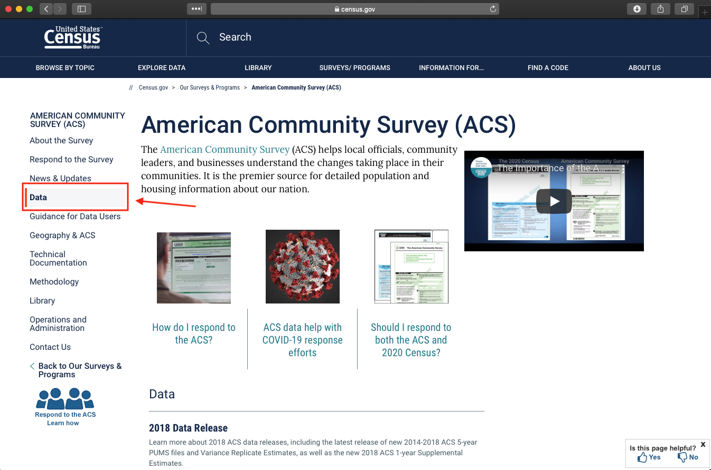

On the next screen, click on the _PUMS_ link which again is on the left.

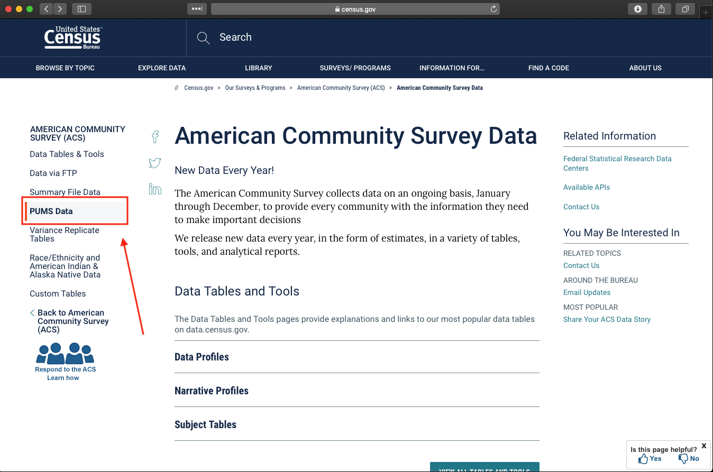

There are a couple of ways to get PUMS data: from the old FTP site or
the newer data.census.gov site. Though it's less pretty, I'll show you
the FTP version (if you have used FTP applications before to access
data, you can use those here).

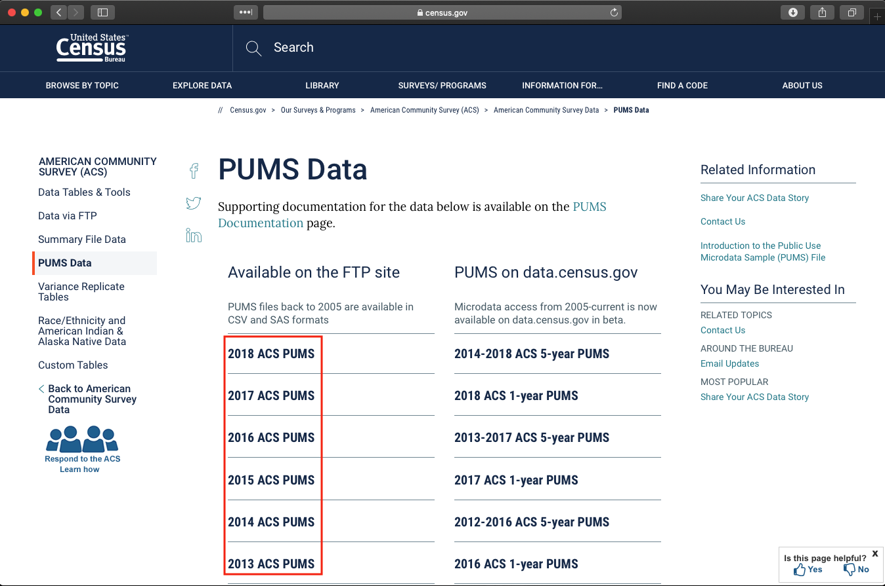

You'll notice the FTP page looks like a file system. That's basically
what it is. Click on the file name you want. For more information on
whether you want 1-, 3-, or 5-year estimates, check out this page:
[census.gov/programs-surveys/acs/guidance/estimates.html](https://www.census.gov/programs-surveys/acs/guidance/estimates.html).

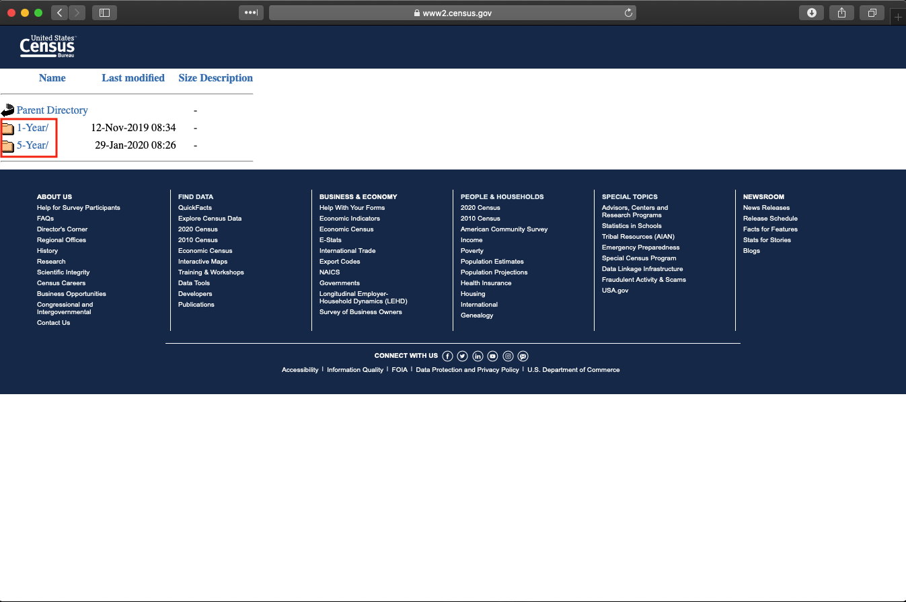

On the final page, you can choose data at the state level. There are
two basic types of files, each pertaining to sections of the survey:

- **Housing:** These files start with _h_ after the underscore
- **Person:** These files start with _p_ after the underscore

For more information about which file to use or PUMS more generally,
visit
[census.gov/programs-surveys/acs/technical-documentation/pums/about.html](https://www.census.gov/programs-surveys/acs/technical-documentation/pums/about.html). 

# Other

Below are some other data sources you may find useful, either on their
own or joined with the data sets above.

- [Current Population
  Survey (www.census.gov/programs-surveys/cps.html)](https://www.census.gov/programs-surveys/cps.html)
- [TIGER/Line
  Shapefiles (www.census.gov/geographies/mapping-files/time-series/geo/tiger-line-file.html)](https://www.census.gov/geographies/mapping-files/time-series/geo/tiger-line-file.html) 
- [Bureau of Labor Statistics (www.bls.gov/data/)](https://www.bls.gov/data/)
- [Delta Cost Project (deltacostproject.org/delta-cost-data)](https://deltacostproject.org/delta-cost-data) 
- [Urban Institute Data
  Explorer (educationdata.urban.org/data-explorer/)](https://educationdata.urban.org/data-explorer/)
- [PISA (www.oecd.org/pisa/data/)](https://www.oecd.org/pisa/data/)  

