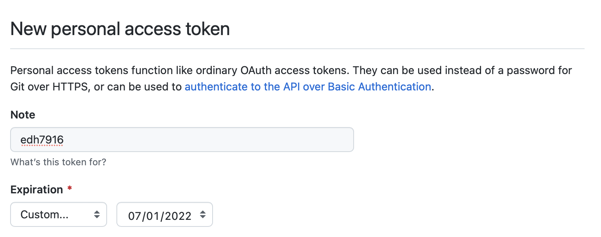
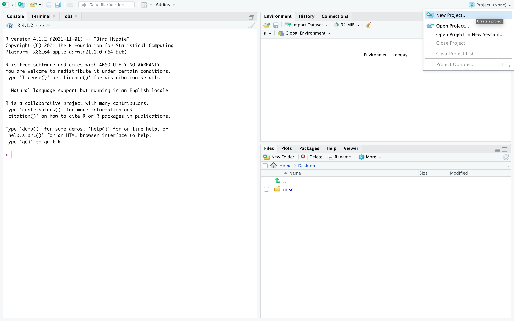
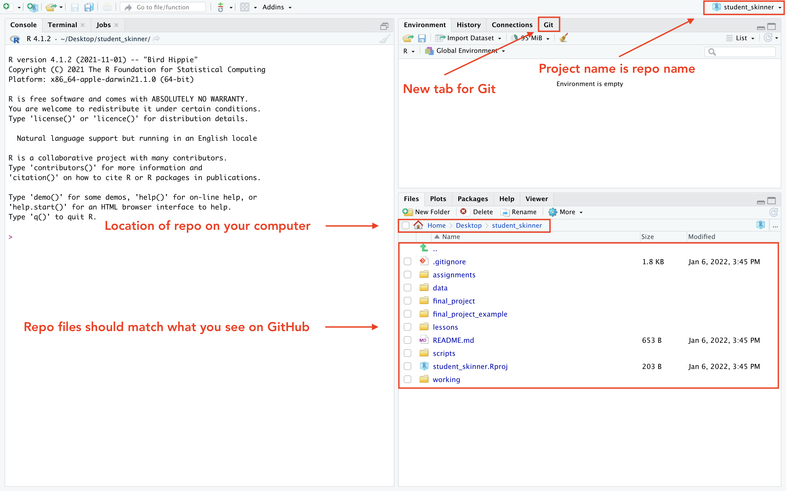
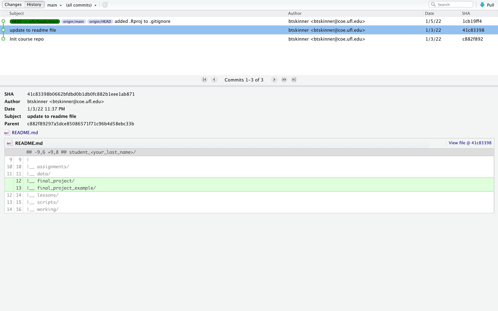
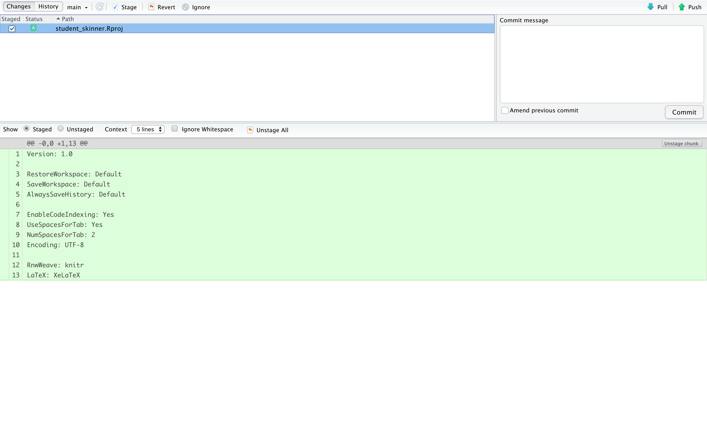
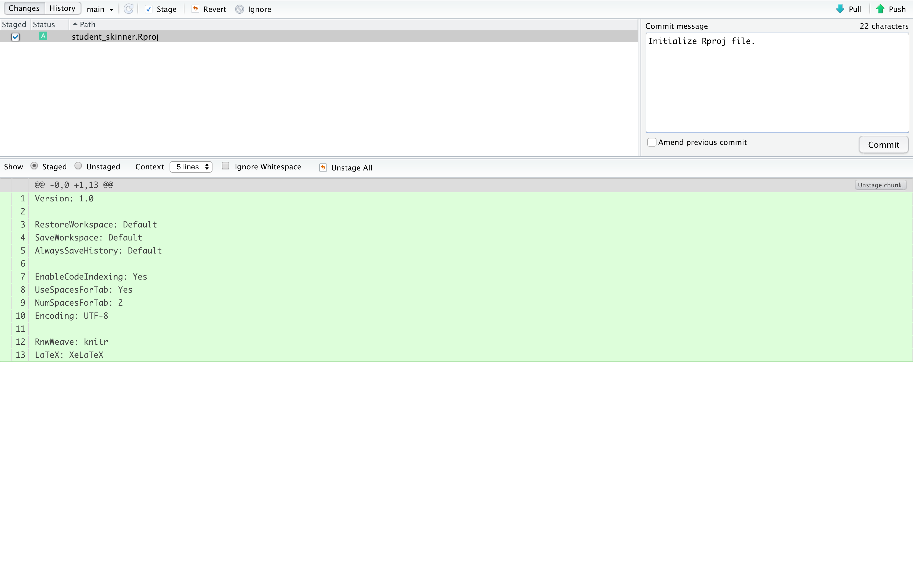
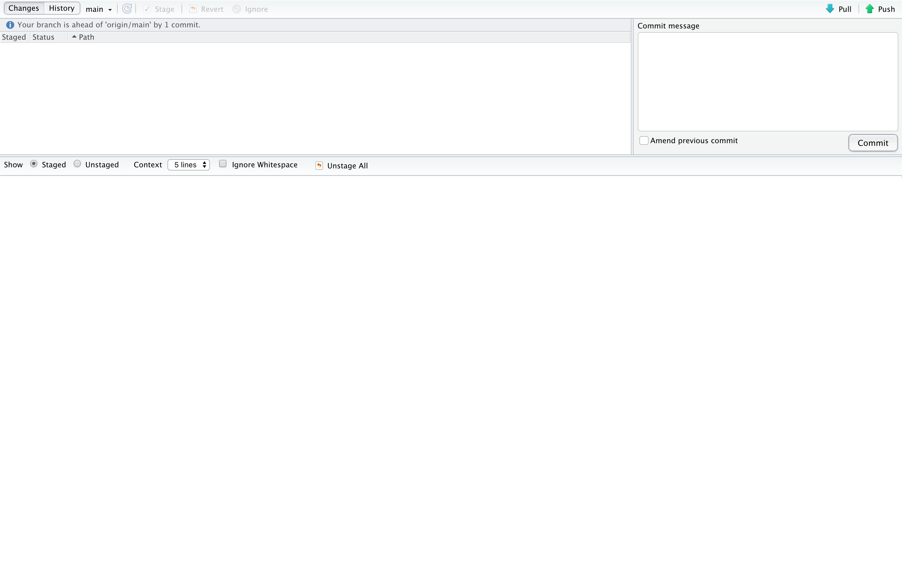
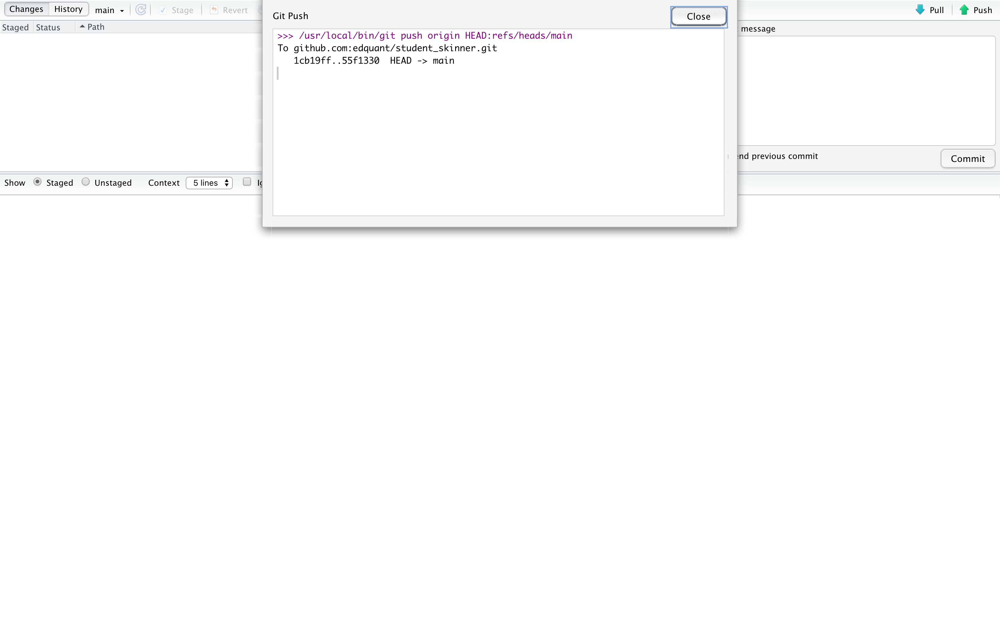
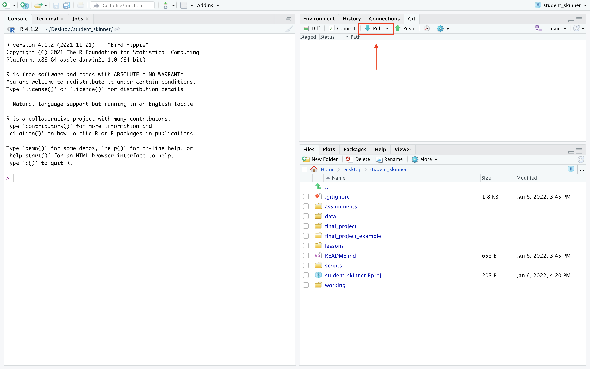

From the git website [http://git-scm.com/](http://git-scm.com/)

> Git is a free and open source distributed version control system
> designed to handle everything from small to very large projects with
> speed and efficiency.  
 
## Why use git?

With so many other (read: easier!) ways to share and collaborate on
documents, why use git? Isn't it a bit overkill to learn an entirely
new syntax? Why not just email files or use something like DropBox?
Because it is very easy to end up with something like this:

[](http://www.phdcomics.com/comics/archive.php?comicid=1531)

*Credit: Jorge Chan*

### As complexity increases, so does the need for git

$$ Project = f(size, scope, collaborators) $$

As any part of that function grows, so too does the need for a work flow that:  

* Allows for many moving parts
* Allows for peaceful collaboration (no overwrites)
* Allows for timely collaboration (synchronous)
* Allows for distant collaboration (centralized file location)
* Allows for version control (so you can go back if necessary)

Git was designed to do all these things, so it works better than other systems.

### What's the difference between git and GitHub?

Yep, you guessed it. Git is the system/language that supports version
control. GitHub is an online service that will host your remote
repositories, for free if public or a small fee if private. (Students
get an education discount and some free repos. Check out
[https://education.github.com/](https://education.github.com/).)  

RStudio is nice because it provides an nice point-and-click interface
for git. ([Sourcetree](https://www.sourcetreeapp.com) and [GitHub
Desktop](https://desktop.github.com) are also really nice GUIs.) If
you want to run git at the command line, go for it! But
using RStudio or another GUI is fine.  

### How does git/GitHub work?

[](https://commons.wikimedia.org/wiki/File:Git_data_flow.png)

*Credit: Lbhtw (Own work)*

### Plain text and git

Git works best with [plain text
files](https://en.wikipedia.org/wiki/Plain_text). This is because it
notes the differences across two plain text files rather than just
copying and re-copying the same file over and over again as it
changes. When you've only changed one word, git's method of version
control is much more efficient than making a whole new copy.

It's also useful when you need to merge two files. If file B is just
file A with new section, file B can be easily merged into file A by
inserting the new section --- just like you would add a paragraph in a
paper you're writing. R scripts are plain text. Some data files, like
*.csv, are plain text. This is why git works really well with data
analysis workflows.

On the other hand, git does not work as well with [binary
files](https://en.wikipedia.org/wiki/Binary_file). These files are
stored in a format closer to what your computer understands, which
comes with benefits. Data files, like Stata's *.dta and R's *.Rdata,
as well as MS Office files --- *.docx, *.xlsx, *.pptx, _etc_ --- are
binary files. Git will keep track of your MS Word document, but due to
its underlying structure, you won't be able to merge and every small
change will just make a whole new copy of the file. This is why we
generally don't commit large binary data files to Git: your repo just
becomes larger and larger with each small change to your data.

### Some notes on work flow (good habits)

1. Always `pull` from your local repo with your remote repo before
   starting any work. This makes sure you have the latest
   files. RStudio has a `pull` button in the **Git** tab. 
2. Don't wait to `push` your commits. Just like you save your papers
   every few lines or paragraphs, you should push to your remote
   repo. This way, you're less likely to lose work in the event of a
   computer crash. Also, should you want to return to a prior version,
   small changes make it easier to find what you want.  
3. Add useful `commit` messages. RStudio will make you add
   something. Don't say "stuff." A version history of 95 "stuff"s is
   pretty non-helpful. Also, I would keep it clean. Even in a private
   repository, work as if someone will see what you write someday.  
4. Don't freak out! If you accidentally push and overwrite or delete
   something on the remote, you can get it back. That's the point of
   version control! Sometimes weird things like merges happen (two
   files with the same name are shoved together). They can be a pain
   to fix, but they can be fixed.
5. Avoid tracking overly large files and pushing them to your remote
   repository. GitHub has a file size limit of 100 MB per file and 1
   GB per repo. The history of large files compounds quickly, so think
   carefully before adding them. Usually this means that small
   data sets are okay; big ones are better backed up somewhere else and
   left on your machine.
6. Remember: even in a private repository, your files are potentially
   viewable. If any of your data sets or files are restricted, do no
   push them remotely. Use `.gitignore` to make sure that git doesn't
   track or push them.

Every class and work session should go like this:

1. `pull` from GitHub remote
2. _do work_
3. `add` or `stage` (if new file) 
4. `commit` with message
5. `push` back to GitHub remote

If you'd like you can also use terminal commands to accomplish the
same things. Many people (including me) like to use the terminal
commands directly.

- Pull: `git pull`
- Stage: `git add <filenames>`
- Commit: `git commit -m "<your message here>"`
- Push: `git push`

That said, you should use whatever works best for you. 

## Getting your class repo and linking with git

In this class, you'll work in and submit your work through a private
git repository that only you and I will be able to access. I've
already set that up in our course organization on GitHub. Let's get
your repo onto your computer.

### Step 0: Install git on your computer

[Follow these directions to install git on your computer]({{ site.baseurl }}/software), 
if you need it and haven't already done so. If you use a Mac, there's
a good chance you already have git on your machine. You can check by
opening the Terminal application and typing `which git` at the
prompt. If you get a response like `/usr/bin/git` then you have
git. It's unlikely to be the newest version, but is probably good
enough for our class. That said, it generally doesn't hurt to install
a newer version.

### Step 1: setting a personal access token or PAT

Before we try to use git through RStudio, we need to set up your
GitHub user credentials on your computer. This is a security feature
of GitHub that prevents others from accessing your account. Think of a
personal access token or PAT as a special type of password that links
your computer to GitHub and that can be set with different levels of
permission on your account. It can be very limited, allowing the
computer user only a very number of options or very broad, giving the
computer user a many ways to interact with GitHub. It can also be set
to expire if you want.

To set up your PAT, we'll once again use [Jenny Bryan's GitHub
guide](https://happygitwithr.com/). Specifically, [we'll use
instructions found
here](https://happygitwithr.com/https-pat.html#tldr). Repeating the
instructions, they are:

In the RStudio console, type the following and press enter:

```r
usethis::create_github_token()
```


This should open up a web page on GitHub to create a token with some
presents. The presets are fine, though I would recommend setting the
PAT to last at least until the course is over (so you don't have to do
all of this again in a month). In this example, I put this course id
in the use _Note_ box and set the expiration for middle of the summer
after the course has ended. Once you've set these, scroll to the
bottom and click the button to generate the PAT.



You see a screen that looks like this:


I've blocked out the letters and numbers after `gh_` (not that I'm
using this PAT since it's now public!), but you should see a full
string. Keep this window open and head back to RStudio.

In the console type and press enter:

```r
gitcreds::gitcreds_set()
```


It will as you to add your password. Paste the `gh_` PAT and press
enter. If it worked, you should see the following:


If you (or someone you share your computer with) has already set up a
PAT in the past, you will be given the option to keep your current set
up or replace. I'll leave that to you. All else being equal, it's
probably better to replace the old PAT with the new PAT unless you
have compelling reason not to do so.

You should now be set to use GitHub with class!

### Step 2: clone your GitHub repo to your computer

Navigate to your GitHub repo at github.com. Once you've signed into
your account, you should be able to navigate to it through GitHub's
interface. Because the repos are structured the same way, you can also
use this link:

```
https://github.com/edquant/<...>
```

Where `<...>` is your repo name. Unless otherwise said, it should take
the form of `student_<last name>` (students with shared last names
will have a slightly different repo name since repo names within the
organization must be unique --- ask me or check your email). For
example, my repo is `student_skinner` and is found at:

```
https://github.com/edquant/student_skinner
```

If you click on this an you aren't me, you'll get a 404 error
page. That's because it's a private repository, meaning only those
with access can see it --- GitHub pretends it doesn't exist
otherwise. If you can't find your repo, double check two things:

- that you have the correct repo name (no typos)
- that you are signed into GitHub

If you are signed in and have the right link, you should see your
page. For example, mine looks like this:


Just above the list of files, click on the button that says clone
(it's green by default).


You'll see a drop down. Confirm that **HTTPS** is bold and
underlined. You'll want to copy to the web address in the text box for
the next step (you can use the overlapping box symbol just to the
right of the address to copy it to your clipboard).

Now, return to RStudio. In the upper right hand corner, you'll see
_Project: (none)_ (if you've been using RStudio, you may have a
project going, meaning it won't say "none", but that's okay). Click on
that to see a drop down list of options. You will click on the first
option _New Project_.



This window will pop up.


Choose the option _Version Control_ option. In the next window that
opens, choose _Git_.


In the final window, paste the URL for your GitHub repo in the first
text box. The middle text box should auto-fill with your repo name:
`student_<last_name>`. The last text box is where you want to store
your repo. On my computer, it shows the Desktop. If you'd rather place
your course files in another place on your computer (_e.g._ a
_projects_ folder or maybe a _class_ folder), then use the _Browse_
button to select a new location. **The main thing is to remember where
you saved it!** Once you're satisfied, click the _Create Project_
button.

 

If everything works, you'll see a drop down window that looks like
it's doing some work with files. It will quickly close and RStudio
will look like it is restarting, when it reopens, you should see your
repo files in the bottom right pane, a new tab that says _Git_, and
your repo name in the upper right as the new project name. You are now
ready to work with your class files!

 

## Staging/adding, committing, and pushing files from your computer to GitHub

There is nothing special about working in a git directory compared to
a normal directory: you still open your files, edit them, and save as
normal. The difference is that along the way, you take an extra step
that involves:

1. _Staging/adding_ your files (telling git to pay attention to the
   changes you've made)
1. _Committing_ your files (confirming that you want git to store your
   changes in your local repository)
1. _Pushing_ your changes (copying changes to your local repository to
   your remote repository --- GitHub)
   
If you click on the _Git_ tab, you'll a new file listed with some
boxes next to it.


This particular file is a settings file and not that important for us,
but it will be good to use as an example. If you want to see
information about the file, click the _Diff_ button on the far left,
just under the _Environment_ tab. 

A new window will open. The bottom window shows the changes made to
the file. Lines with additions are in green; lines with subtractions
are in red. Because this is a new file, the entire text is
green. 


If you click on the _History_ button, you can see the history
of changes to the repo. There's not much right now, but over time, the
history can be _very_ helpful for finding deleted code or pinpointing
when a bug was introduced.



Going back by clicking on _Changes_ window, let's stage/add our file, commit it,
and push it.

### Stage/add

To stage/add a file, click the box next to the file name. You'll
notice that the two boxes under the _Status_ header become a single
box with an "A" in it for **Add**.



### Commit

Next, you need to **Commit** the changes to the local repository. Do
this by writing a message in the box on the right. You can write
whatever you want, but per the suggestions above, I recommend
something short and informative. Once you're done, click the _Commit_ button.



You'll see a drop down menu telling you what has happened. At first
this can seem like nothing, but over time, you'll get the hang of the
messages. This tells you that 1 file (our `Rproj` file changed with 13
new lines (if there were deletions, it would say that, too). You can
close this out.


After closing, notice that you don't see the file name any more or the
changes in the bottom panel. However, there is new line towards the
top left that tells you "Your branch is ahead of origin/main by 1
commit." _origin/main_ is the git name of your remote repo: _origin_
is the remote (GitHub) and _main_ is the specific branch (we will only
use the "main" branch in this course). In other words, your local repo
has changes that are one step ahead of what's on GitHub. Time to sync
them up! 



### Push

Pushing the changes to GitHub is simple: just click the _Push_ button
in the far upper right (up arrow). Once again, you'll get a drop down
window with messages from git. There's no error (it'll let you know),
so you can close the window.



When you go back to the main RStudio window, you'll notice that file
is no longer listed in the _Git_ tab. Should you make changes to it,
it will reappear. Similarly, any files in your local repo that you
change, add, or delete will show up here.


If you want to confirm that the push worked, go to your repo at
GitHub. If you can see the new file and the commit message, then you
know your changes have made it to your GitHub repo. Importantly for
this course, if you see the changes on GitHub, that means I can see
them. Conversely, if you don't see the changes on GitHub, then I can't
see them. Double check!


## Pulling down changes from GitHub

Closing the loop, you also need to **pull** down changes from
GitHub. In general, this is necessary when are you are using multiple
computers or working with a collaborator. For this course, you'll need
to pull down updates and comments I make to your repo. 

To pull, all you need to do is click the _Pull_ button in the _Git_
tab (with the down arrow).



If there's nothing new, you'll get a message like this. If so, you're
good to go!


If there are changes, you'll be informed of those and you'll see them
reflected in your local files. If there's a new file, you'll see it
appear in your local directory. If a file is deleted, it will be removed
from your local directory. If there were any changes in a file, you'll
see them when you next open the file.

### Committing changes before pulling down

One thing that catches new (and experienced!) git users is forgetting
to stage/add and commit changes **before** pulling down new changes
from the remote repo. If you try to pull from GitHub and there's a
change to a file you have changed but haven't add/stage + committed,
the pull won't work. It's annoying, but it's actually a nice feature:
this prevents changes that you aren't tracking and therefore can't
recover. 

If this happens, stage/add and commit your local changes and then
pull. If you have made changes that don't align with the new changes
you just pulled down, you'll end up with a merged file. It can look
messy, but it's totally fixable. If this happens and you have trouble,
let me know.

## Final note about git and this course

[By construction of the scripts I use to build this
course](https://www.btskinner.io/grm/), I have the ability to
overwrite files you use. That said, I will only overwrite stuff that I
put in there, like lessons, assignments, class scripts, etc. I will
never overwrite anything you add. Also, I will not overwrite
anything you put in the `working` folder. That's yours.

If you want to, for example, take notes in class scripts using
comments (a very good idea), then simply rename the script. For
example, you could rename the `intro_r.R` script to
`intro_r_notes.R`. That way, when I update your repo, you won't lose
your notes when `intro_r.R` is reset.
